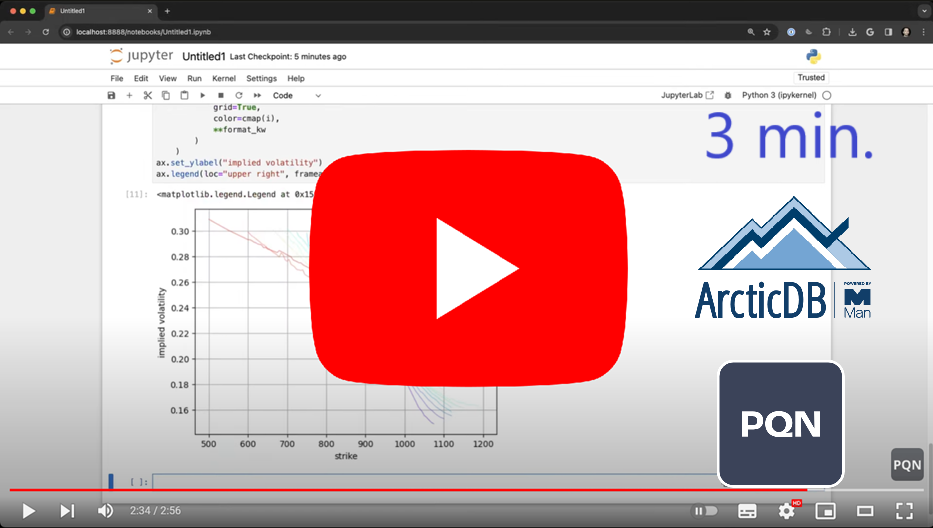

<p align="center">
  
</p>

---

<div align="center">
  <p><b>Three minute ArcticDB demo from PyQuantNews</b></p>
  <a href="https://www.youtube.com/watch?v=5_AjD7aVEEM">
    
  </a>
</div>

---
<p align="center">
:earth_americas: <a href="http://arcticdb.io">ArcticDB Website</a> | 📘 <a href="https://docs.arcticdb.com">ArcticDB Docs</a> | 📰: <a href="https://medium.com/arcticdb">ArcticDB Blog</a> | :mega: <a href="https://www.man.com/man-group-brings-powerful-dataframe-database-product-arcticdb-to-market-with-bloomberg">Press Release</a> | :mega: <a href="https://www.bloomberg.com/company/press/man-group-brings-powerful-dataframe-database-product-arcticdb-to-market-with-bloomberg/">Press Release</a> | :busts_in_silhouette: <a href="#community">Community</a>
<br /><br />
<a href="https://github.com/man-group/ArcticDB/actions"></a>
</p>

---

**ArcticDB** is a high performance, serverless **DataFrame database** built for the Python Data Science ecosystem.
Launched in March 2023, it is the successor to [Arctic](https://github.com/man-group/arctic).

Use of ArcticDB in production (including business or commercial environments) or for a Database Service requires a paid for license from ArcticDB Limited . Please contact info@arcticdb.io for further details.

ArcticDB offers an intuitive Python-centric API enabling you to read and write Pandas DataFrames to S3 or LMDB utilising a fast C++ data-processing and compression engine.

ArcticDB allows you to:

 * **Pandas in, Pandas out**: Read and write Pandas DataFrames, NumPy arrays and native types to S3 and LMDB without leaving Python.
 * **Built for time-series data**: Efficiently index and query time-series data across _billions_ of rows
 * **Time travel**: Travel back in time to see previous versions of your data and create customizable snapshots of the database
 * **Schemaless Database**: Append, update and modify data without being constrained by the existing schema
 * **Optimised for streaming data**: Built in support for efficient sparse data storage
 * **Powerful processing**: Filter, aggregate and create new columns on-the-fly with a Pandas-like syntax
 * **C++ efficiency**: Accelerate analytics though concurrency in the C++ data-processing engine

ArcticDB handles data that is big in both row count and column count, so a 20-year history of more than 400,000 unique securities can be stored in a single *symbol*. Each *symbol* is maintained as a separate entity with no shared data which means ArcticDB can scale horizontally across *symbols*, maximising the performance potential of your compute, storage and network.

ArcticDB is designed from the outset to be resilient; there is no single point of failure, and persistent data structures in the storage mean that once a version of a *symbol* has been written, it can never be corrupted by subsequent updates. Pulling compressed data directly from  storage to the client means that there is no server to overload, so your data is always available when you need it.

## Quickstart

### Prebuilt binary availability (for the current version)

|                       | [PyPI (Python 3.8 - 3.14)](https://pypi.org/project/arcticdb/) | [conda-forge (Python 3.10 - 3.14)](https://github.com/conda-forge/arcticdb-feedstock/?tab=readme-ov-file#current-release-info) |
| --------------------- | -- | -- |
| Linux `x86_64`        | ✔️ | ✔️ |
| Linux `arm64`         | ➖ | ✔️ |
| Windows `x86_64`      | ✔️ | ✔️ |
| MacOS `x86_64`        | ➖ | ✔️ |
| MacOS `arm64`         | ✔️ | ✔️ |

### Storage compatibility

|                       | Linux | Windows | Mac |
| --------------------- | - | - | - |
| S3                 | ✔️ | ✔️ | ✔️ |
| LMDB               | ✔️ | ✔️ | ✔️ |
| Azure Blob Storage | ✔️ | ✔️ | ✔️ |

We have tested against the following S3 backends:
- AWS S3
- Ceph
- MinIO on Linux
- Pure Storage S3
- Scality S3
- VAST Data S3

### Installation

Install ArcticDB:

```bash
$ pip install arcticdb
```
or using conda-forge
```bash
$ conda install -c conda-forge arcticdb
```

Import ArcticDB:

```Python
>>> import arcticdb as adb
```

Create an instance on your S3 storage (with or without explicit credentials):

```Python
# Leave AWS to derive credential information
>>> ac = adb.Arctic('s3://MY_ENDPOINT:MY_BUCKET?aws_auth=true')

# Manually specify creds
>>> ac = adb.Arctic('s3://MY_ENDPOINT:MY_BUCKET?region=YOUR_REGION&access=ABCD&secret=DCBA')
```

Or create an instance on your local disk:

```Python
>>> ac = adb.Arctic("lmdb:///<path>")
```

Create your first library and list the libraries in the instance:

```Python
>>> ac.create_library('travel_data')
>>> ac.list_libraries()
```

Create a test dataframe:
```Python
>>> import numpy as np
>>> import pandas as pd
>>> NUM_COLUMNS=10
>>> NUM_ROWS=100_000
>>> df = pd.DataFrame(np.random.randint(0,100,size=(NUM_ROWS, NUM_COLUMNS)), columns=[f"COL_{i}" for i in range(NUM_COLUMNS)], index=pd.date_range('2000', periods=NUM_ROWS, freq='h'))
```

Get the library, write some data to it, and read it back:

```Python
>>> lib = ac['travel_data']
>>> lib.write("my_data", df)
>>> data = lib.read("my_data")
```

To find out more about working with data, visit our [docs](https://docs.arcticdb.io)

---

## Documentation

The source code for the ArcticDB docs are located in the [docs](https://github.com/man-group/ArcticDB/tree/master/docs) folder, and are hosted at [docs.arcticdb.io](https://docs.arcticdb.io).

## License

ArcticDB is released under a [Business Source License 1.1 (BSL)](https://github.com/man-group/ArcticDB/blob/master/LICENSE.txt)

BSL features are free to use and the source code is available, but users may not use ArcticDB for production use or for
a Database Service, without agreement with Man Group Operations Limited.

Use of ArcticDB in production or for a Database Service requires a paid for license from ArcticDB Limited
and is licensed under the ArcticDB Software License Agreement. For more information please contact [info@arcticdb.io](mailto:info@arcticdb.io).

The BSL is not certified as an open-source license, but most of the [Open Source Initiative (OSI)](https://opensource.org/) criteria are met.
Please see version conversion dates in the below table:

| ArcticDB Version | License | Converts to Apache 2.0 |
| ------------- | ------------- | ------------- |
| 1.0 | Business Source License 1.1 | Mar 16, 2025 |
| 1.2 | Business Source License 1.1 | May 22, 2025 |
| 1.3 | Business Source License 1.1 | Jun  9, 2025 |
| 1.4 | Business Source License 1.1 | Jun  23, 2025 |
| 1.5 | Business Source License 1.1 | Jul  11, 2025 |
| 1.6 | Business Source License 1.1 | Jul  25, 2025 |
| 2.0 | Business Source License 1.1 | Aug  29, 2025 |
| 3.0 | Business Source License 1.1 | Sep  13, 2025 |
| 4.0 | Business Source License 1.1 | Sep  27, 2025 |
| 4.1 | Business Source License 1.1 | Nov 1, 2025 |
| 4.2 | Business Source License 1.1 | Nov 12, 2025 |
| 4.3 | Business Source License 1.1 | Feb 7, 2026 |
| 4.4 | Business Source License 1.1 | Apr 5, 2026 |
| 4.5 | Business Source License 1.1 | Aug 14, 2026 |
| 5.0 | Business Source License 1.1 | Oct 31, 2026 |
| 5.1 | Business Source License 1.1 | Nov 15, 2026 |
| 5.2 | Business Source License 1.1 | Jan 27, 2027 |
| 5.3 | Business Source License 1.1 | Mar 24, 2027 |
| 5.4 | Business Source License 1.1 | Apr 28, 2027 |
| 5.5 | Business Source License 1.1 | May 13, 2027 |
| 5.6 | Business Source License 1.1 | May 26, 2027 |
| 5.7 | Business Source License 1.1 | Jun 2, 2027 |
| 5.8 | Business Source License 1.1 | Jun 9, 2027 |
| 5.9 | Business Source License 1.1 | Jul 7, 2027 |
| 5.10 | Business Source License 1.1 | Jul 29, 2027 |
| 6.1 | Business Source License 1.1 | Aug 20, 2027 |
| 6.2 | Business Source License 1.1 | Sep 8, 2027 |
| 6.3 | Business Source License 1.1 | Nov 3, 2027 |
| 6.5 | Business Source License 1.1 | Dec 11, 2027 |
| 6.6 | Business Source License 1.1 | Jan 6, 2028 |

## Code of Conduct

[Code of Conduct](https://github.com/man-group/ArcticDB/blob/master/CODE_OF_CONDUCT.md)

This project has adopted a Code of Conduct. If you have any concerns about the Code, or behaviour that you have
experienced in the project, please contact us at [info@arcticdb.io](mailto:info@arcticdb.io).

## Contributing/Building From Source

We welcome your contributions to help us improve and extend this project!

Please refer to the [Contributing](https://github.com/man-group/ArcticDB/blob/master/docs/mkdocs/docs/technical/contributing.md)
page and feel free to open issues on GitHub.

We are also always looking for feedback from our dedicated community! If you have used ArcticDB please let us know, we would love to hear about your experience!

Our release process is [documented here](https://github.com/man-group/ArcticDB/wiki/Releasing).

## Community

We would love to hear how your ArcticDB journey evolves, email us at [info@arcticdb.io](mailto:info@arcticdb.io) or come chat to us on [Twitter](https://www.twitter.com/arcticdb)!

Interested in learning more about ArcticDB? Head over to our [blog](https://medium.com/arcticdb)!

Do you have any questions or issues? Chat to us and other users through our dedicated Slack Workspace - sign up for Slack access on [our website](https://arcticdb.io).

