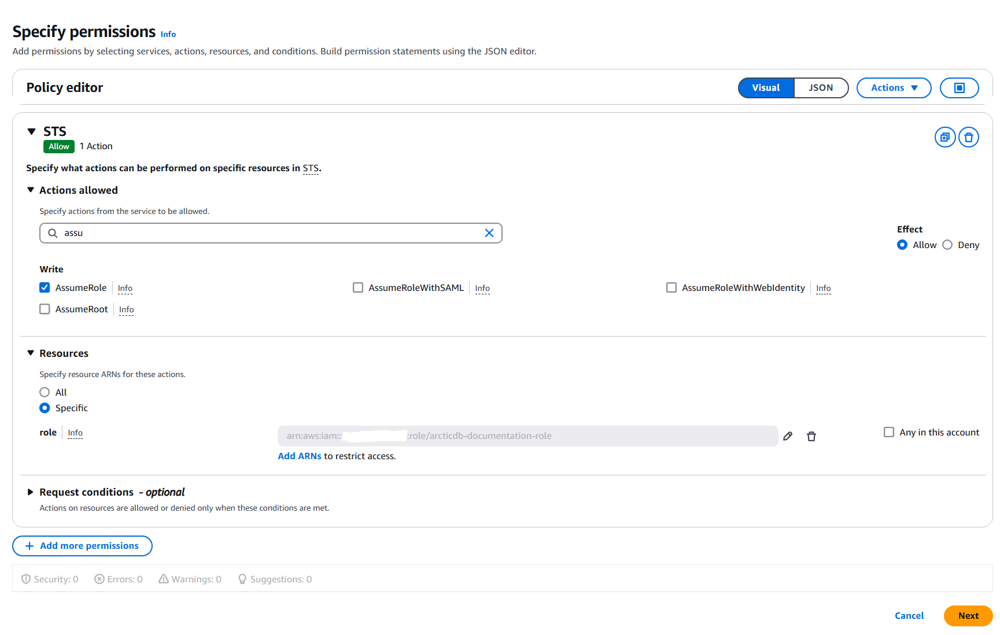

# Getting Started with AWS S3

For a detailed guide on configuring Amazon S3, refer to the official AWS documentation: [Creating Your First Bucket](https://docs.aws.amazon.com/AmazonS3/latest/userguide/creating-bucket.html).

# Best Practices for Setting Up AWS S3 Using an Access Key

The best practices for using AWS S3 depend on your specific use case. If you're looking to try **ArcticDB** on AWS S3, a simple and effective approach is outlined below.

### 1. Create a Policy for Accessing S3 Buckets
1. Navigate to **IAM -> Policies -> Create Policy**.  
2. Choose **S3** as the service, and select the following Access Level permissions:

| Permission           | Description               |
|-----------------------|---------------------------|
| `s3:GetObject`        | Read objects              |
| `s3:PutObject`        | Write objects             |
| `s3:DeleteObject`     | Delete objects            |
| `s3:ListBucket`       | List bucket contents      |

3. Specify the S3 buckets this policy will allow access to. 

   

4. Click **Next**, review, and give the policy a meaningful name.  

    

5. Click **Create Policy**.  

### 2. Create an IAM User

It is best practice to manage and access S3 buckets using a non-root IAM account in AWS. For trial purposes, it is recommended to create a dedicated IAM account specifically for testing ArcticDB.

Follow these steps to create an IAM user:

1. Navigate to [IAM > Users](https://console.aws.amazon.com/iamv2/home#/users).
2. Click **Add users**.
3. Choose a username, such as `arcticdbtrial`, and click **Next**.
4. Select **Attach policies directly** and attach the policy created in [step 1](###1-create-a-policy-for-accessing-s3-buckets) to the user.
5. Click **Next** to review.
6. Click **Create user**.

---

### 3. Create the Access Key

1. Navigate to the [IAM > Users](https://console.aws.amazon.com/iamv2/home#/users) table and click on the newly created user.  
2. Go to the **Security credentials** tab and locate the **Access keys** section.  
3. Click **Create access key**.  
4. Select the **Local code** option (ArcticDB is the local code).  
5. Check the box for **I understand...** and click **Next**.  
6. Click **Create access key**.  
7. Record the **Access key** and **Secret access key** securely, as they will not be displayed again after closing the screen.

---

### 4. Create the Bucket

The remaining steps can be performed using commands on your client machine. 

#### Step 1: Install the AWS CLI
If you don’t already have the AWS Command Line Interface (CLI) installed, follow the [official AWS CLI installation guide](https://docs.aws.amazon.com/cli/latest/userguide/getting-started-install.html).

#### Step 2: Configure the AWS CLI
Use the AWS CLI to configure your client machine with the **Access Key** and **Secret Access Key** created earlier. You will also need to select an [AWS region](https://docs.aws.amazon.com/general/latest/gr/rande.html). For optimal performance, choose a region local to your ArcticDB client.

Run the following command and provide the required details:

```bash
$ aws configure
AWS Access Key ID [None]: <ACCESS_KEY>
AWS Secret Access Key [None]: <SECRET_KEY>
Default region name [None]: <REGION>
Default output format [None]:
```

Bucket names must be globally unique, so you will need to create your own unique name. Use the following command to create the bucket:
```bash
$ aws s3 mb s3://<BUCKET_NAME>
```

### 5. Connect to the bucket

- [Install ArcticDB](https://github.com/man-group/ArcticDB#readme).
- Use your `<REGION>` and `<BUCKET_NAME>`.
- Setup `~/.aws/credentials` with `aws configure`, as above.
```python
import arcticdb as adb
arctic = adb.Arctic('s3://s3.<REGION>.amazonaws.com:<BUCKET_NAME>?aws_auth=true')
```

### 6. Checking Connectivity to the S3 Bucket - Troubleshooting

#### 1. Permissions

ArcticDB relies on the following five S3 methods for its operations:

 Method       | Permission required
------------- | -------------------
GetObject     | s3:GetObject
HeadObject    | s3:GetObject
PutObject     | s3:PutObject
DeleteObject  | s3:DeleteObject
ListObjectsV2 | s3:ListBucket

#### 2. Verification Script
You can use the following script to verify connectivity to an S3 bucket from your client machine. If the script executes successfully, the configuration should be correct for read and write operations with ArcticDB.

#### 3. Prerequisites:
1. Replace `<BUCKET_NAME>` in the script with your bucket name.  
2. Install [boto3](https://boto3.amazonaws.com/v1/documentation/api/latest/guide/quickstart.html#installation).  
3. Set up your AWS credentials in `~/.aws/credentials` using the `aws configure` command (as described earlier).  

#### 4. Python Script:
```python
import io
import boto3

# Initialize the S3 client
s3 = boto3.client('s3')

# Replace '<BUCKET_NAME>' with your actual bucket name
bucket = '<BUCKET_NAME>'

# Perform operations to check connectivity
s3.put_object(Bucket=bucket, Key='_arctic_check/check.txt', Body=io.BytesIO(b'check file contents'))
s3.list_objects_v2(Bucket=bucket, Prefix='_arctic_check/')
s3.head_object(Bucket=bucket, Key='_arctic_check/check.txt')
s3.get_object(Bucket=bucket, Key='_arctic_check/check.txt')
s3.delete_object(Bucket=bucket, Key='_arctic_check/check.txt')
```

#### 5. Notes:
The check object written by this script (_arctic_check/check.txt) is temporary and will not interfere with normal ArcticDB operations on the bucket.
If any of the operations fail, verify the permissions assigned to your IAM role or user, and ensure the bucket is correctly configured.


# Best Practices for Setting Up AWS S3 Using STS

AWS Security Token Service (STS) enables users to assume specific roles to gain temporary access to AWS resources. This guide details the steps required for setting up STS to access Amazon S3 buckets.

## Getting Started with STS Setup

### 1. Create a Policy for Accessing S3 Buckets

1. Navigate to **IAM -> Policies -> Create Policy**.  
2. Choose **S3** as the service, and select the following Access Level permissions:

| Permission           | Description               |
|-----------------------|---------------------------|
| `s3:GetObject`        | Read objects              |
| `s3:PutObject`        | Write objects             |
| `s3:DeleteObject`     | Delete objects            |
| `s3:ListBucket`       | List bucket contents      |

3. Specify the S3 buckets this policy will allow access to. 

   

4. Click **Next**, review, and give the policy a meaningful name.  

    

5. Click **Create Policy**.  

---

### 2. Create a Role to Access S3 Buckets

1. Navigate to **IAM -> Roles -> Create Role**.  
2. Select the appropriate **Trusted Entity Type** for your use case.  

  

3. In the permissions step, attach the policy created in the previous step.  

  

4. Give the role a meaningful name and click **Create Role**.  
5. Copy the **Role ARN** for use in the next step.

---

### 3. Create a Policy to Assume the Role Using STS

1. Navigate to **IAM -> Policies -> Create Policy**.  
2. Select **STS** as the service, and grant the **AssumeRole** permission.  
3. Specify the **Role ARN** created in the previous step.  

  

4. Name the policy and click **Create Policy**.

---

### 4. Create an IAM User (Optional) and Attach the STS Policy

In many cases, a dedicated IAM user is not required, as it is typically managed by the organization's IT services. However, if needed, follow these steps to create an IAM user for your services (e.g., ArcticDB).  

1. Navigate to **IAM -> Users -> Create User**.  
2. Enter a username and proceed to the next step.  

    

3. Select the **Attach policies directly** option and attach the policy created in Step 3.  
  
    

4. Click **Create User**.  
5. After the user is created, navigate to the **Security Credentials** tab for the user and create an **Access Key**.  
6. Copy the **Access Key** and **Secret Access Key** immediately, as these will not be shown again.

---

### 5. Configure the ArcticDB Client to Access AWS and Assume the Role

To use the setup with ArcticDB, configure the credentials in the AWS shared **config** file.

#### File Locations:

| Platform              | File Location                                                                                                                              |
|-----------------------|--------------------------------------------------------------------------------------------------------------------------------------------|
| Linux and macOS       | `~/.aws/config`                                                                                                                           |
| Windows               | `%USERPROFILE%\.aws\config`                                                                                                               |

#### Example Configuration:

```ini
[profile PROFILE]
role_arn = ROLE_ARN_TO_BE_ASSUMED
source_profile = BASE_PROFILE

[profile BASE_PROFILE]
aws_access_key_id = YOUR_ACCESS_KEY_ID
aws_secret_access_key = YOUR_SECRET_ACCESS_KEY
```

Use the configuration in ArcticDB:
```python
>>> import arcticdb as adb
>>> arctic = adb.Arctic('s3://s3.REGION.amazonaws.com:BUCKET?aws_auth=sts&aws_profile=PROFILE')
```

For more in-depth documentation please refer to [the offical website](https://docs.aws.amazon.com/IAM/latest/UserGuide/id_credentials_temp.html).

## Common Errors When Working with STS

When using STS with ArcticDB, the following common errors may occur. These are typically caused by issues with the AWS C++ SDK, incorrect IAM account setup, or misconfigured files.

---

### 1. **Assertion Error in AWS C++ SDK**

If ArcticDB fails to obtain a temporary token by assuming a role, you may encounter an assertion error like the one below:

```
virtual void Aws::Auth::STSProfileCredentialsProvider::Reload(): Assertion `!profileIt->second.GetCredentials().IsEmpty()' failed.
```

#### Cause:
This error is usually caused by:
- An incorrect IAM account setup.
- An invalid or misconfigured AWS credentials file.

#### Solution:
- Verify that the IAM Role ARN is correct.
- Ensure the AWS credentials file (`~/.aws/config` or `%USERPROFILE%\.aws\config`) is properly configured with the correct role and base profile.

---

### 2. **Permission Error**

You may encounter a permission error like the following:

```
arcticdb_ext.exceptions.PermissionException: E_PERMISSION Permission error: S3Error#15 AccessDenied: Access Denied for object '_arctic_cfg/cref/'
```

#### Cause:
This error indicates a problem with the configuration file. Specifically:
- The **Role ARN** or **Base Profile** in the AWS configuration file is incorrect.

#### Solution:
- Double-check the `role_arn` and `source_profile` values in your AWS configuration file.
- Ensure that the IAM Role has the necessary permissions to access the required S3 bucket and objects.

---

### 3. **Retryable Storage Error**

If there is a network connectivity issue, you might see the following error:

```
arcticdb_ext.exceptions.StorageException: E_S3_RETRYABLE Retry-able error: S3Error#99 : Encountered network error when sending http request for object '_arctic_cfg/cref/'
```

#### Cause:
This error occurs when:
- There is a loss of network connectivity during an S3 operation.
- ArcticDB is unable to re-establish a connection after several retry attempts.

#### Solution:
- Verify your network connection.
- Ensure that the S3 endpoint is reachable from your environment.

