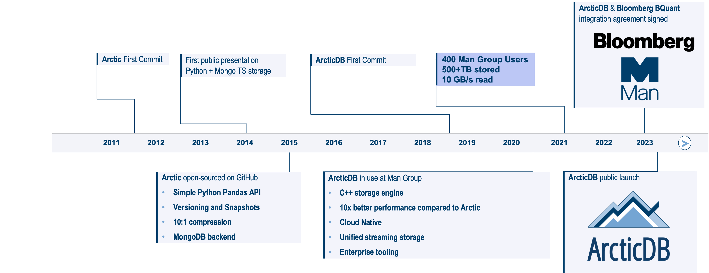

# History of ArcticDB

### Arctic

ArcticDB is built upon the foundations of [Arctic](https://github.com/man-group/arctic), 
an open-source, high performance datastore written in Python which utilises MongoDB as the backend 
storage. Arctic has been under development within Man Group since 2012 and from its very first 
release has underpinned the research and trading environments at Man Group.

[Arctic](https://github.com/man-group/arctic) was open sourced in 2015 and has since racked up over 
2,800 GitHub stars and over a million package downloads.

### ... to ArcticDB!

In 2018, Man Group embarked on a ground-up rewrite in order to improve upon some of the 
foundational limitations of Arctic. We called this version ArcticDB, and is differentiated
from Arctic in three main ways:

1. ArcticDB does not depend on Mongo. Instead, ArcticDB is designed to work with consumer grade
S3 - on prem or in the cloud.
2. ArcticDB is written in C++, enabling signficant performance improvements. ArcticDB is an order
of magnitude faster than Arctic whilst being vastly easier to set up and get started with. 
3. ArcticDB unifies streaming and batch workflows behind the same easy to use, consistent API. 

All in all, ArcticDB offers tremendous, scalable and portable performance with the same intuitive 
Python and Pandas-centric API as Arctic. Behind the scenes, it utilises a custom C++ storage engine, along with 
modern S3-compatible object storage. Both bulk and streaming data workflows have unified APIs,
offering a bi-temporal view of data history with no performance penalty. 

ArcticDB's versatility and ease-of-use have made it the database of choice
for all front-office timeseries analysis at Man Group.

For more information on how ArcticDB is licensed, please see the [licensing FAQ](licensing.md).
