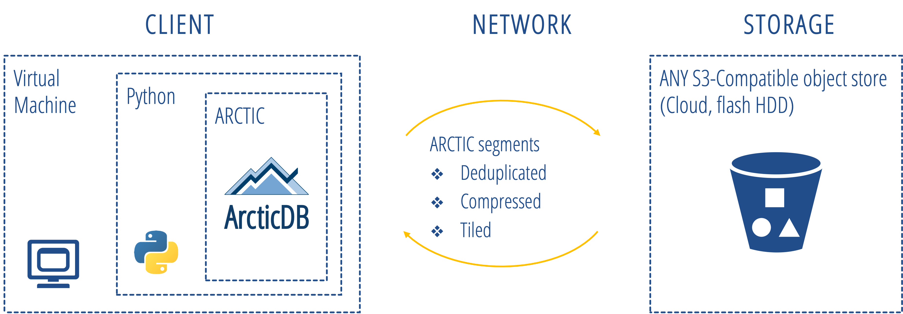
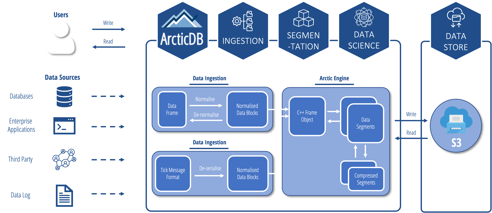

# Architecture

## Overview

ArcticDB is deployed as a shared library, using [PyBind](https://github.com/pybind/pybind11) for operability between CPython and the core database engine which is written in C++.

Users interact with the C++ storage engine, and therefore the storage itself, via the Python/C++ bindings. The engine transforms Python objects which are typically DataFrames, Series or numpy arrays to and from its internal columnar structure. The data is then tiled, indexed, compressed, and written to storage. The storage format is tailor-designed for the storage and retrieval of dense and sparse timeseries data. 

Please note that there is **no required server** component.

## ArcticDB DataFlow

The below diagram visualises the flow of data through ArcticDB from source to storage and back again:

For more information on the storage format, please see [On-Disk Storage](on_disk_storage.md).