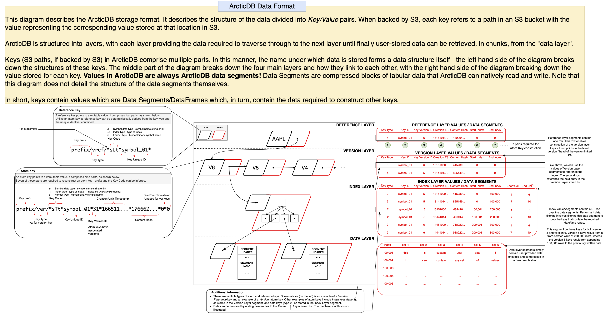

# ArcticDB On-Disk Storage Format

ArcticDB uses a custom storage format that differs from Parquet, HDF5 or other similar well-known columnar storage formats. This page provides a high-level description of this format.

The ArcticDB storage engine is designed to work with any key-value storage backend and currently has full *optimised* support for the following backends:

1. S3
2. MongoDB
3. LMDB

The structure of the stored data is optimised for that storage - for example, when using S3 all related paths (or *keys*) share a common prefix to optimise for `ListObjects` calls.

Despite this storage specific optimisation, the hierarchy and segment format remain identical regardless of the backend storage. These components are described below.

## Structural overview

<figure markdown>
  
  <figcaption>Storage Format Overview - S3</figcaption>
</figure>

The above diagram provides an overview of this format, illustrating how ArcticDB manages the symbol metadata, version history and index layout of the data it stores. Not shown is the binary format used to store ArcticDB segments. [This is described later in this document](#arcticdb-data-segments).

!!! note 

    Please note that the key formatting illustrated on the left hand side of the above diagram is specific to S3. The formatting may differ depending on the underlying storage and as such the key paths might not match 
    when using another storage engine such as LMDB or MongoDB.

The ArcticDB storage format is comprised of 4 layers; the **Reference Layer**, the **Version Layer**, the **Index Layer** and finally, the **Data Layer**. For a full definition of a key, please see the above diagram. 

### Reference Layer

The reference layer maintains an active pointer to the head of the [version layer](#version-layer) linked list, which enabled fast retrieval of the latest version of a symbol. This pointer is stored in the Data Segment as illustrated in the above diagram. As a result, the reference layer is the only mutable part of ArcticDB's storage format with the value of each reference-layer-key able to be overwritten (hence using a _Reference Key_, rather than an _Atom Key_)

Much like all values in ArcticDB, the value is a [data segment](#arcticdb-data-segments), which is described in more detail later in this document.

### Version Layer

The version layer contains a linked list of immutable atom keys/values. Each element of the linked list contains two pointers in the data segment; One pointer points to the next entry in the linked list and one pointer points to an index key, providing a route through to the index layer of the storage structure. As a result, traversing the version layer linked list for a symbol allows you to travel backwards through time to retrieve data as it were at a previous version/point in time. The version layer can contain complex additional structures, such as [version tombstones](#tombstones).

### Index Layer

The index layer is an immutable layer that provides a B-Tree index over the data layer. Much like the reference and version layer, this utilises [data segments](#data-segment) containing data pointers. Each pointer is simply a key that that contains a data segment. 

For more information on the data stored in this layer, see the [Structural Overview diagram](#structural-overview).

### Data Layer

The data layer is an immutable layer that contains compressed [data segments](#arcticdb-data-segments).

## ArcticDB Data Segments

ArcticDB's columnar data format consists of LZ4-compressed column-orientated blocks prefixed with a protobuf header. Diagram to be added...

## Additional Information

### Tiling

ArcticDB tiles dataframes into ArcticDB Data Segments by column and by row. In a static schema library where the columns can be relied upon to always be in the same place, column slicing is done by the column offset. In a dynamic schema library the column names are hashed and the hashes partitioned into a number of buckets.

Tiling in this manner enables efficient data retrieval via selectively filtering down to only the required keys when processing the index layer, as can be seen in the [Structural Overview](structural-overview).

### Tombstones

Information about the existence of an object is not automatically removed, meaning that the version layer tends to grow larger over time. Rather than deleting a version entry when the underlying data is deleted, a tombstone key is inserted into the list indicating the time at which the data was removed. This avoids a class of consistency problems that would result from the simultaneous deletion and recreation of objects, and ensures that version numbers increase monotonically for the life of a symbol. Since the size of the version database is small compared to the main body of data, and version information is compacted into a small number of objects, this is not usually a problem. However, if required, information about deleted versions over a specific time horizon can be permanently removed.

### In-band vs out-of-band operations

ArcticDB is an [embedded database engine with no monolithic server process](../architecture). A database running a server process would normally run various threads performing specific tasks such as storage compaction, removal of deleted data, synchronization to locations, indexing etc. As a client-only, cloud-native database, ArcticDB has two approaches to managing such housekeeping tasks. In single-user mode, tasks are performed in the client, and are designed to be resumable should the client unexpectedly exit (for example of the user killed the process). ArcticDB however can also be configured to use the ArcticDB Enterprise Tooling, which runs these tasks as microservices.
