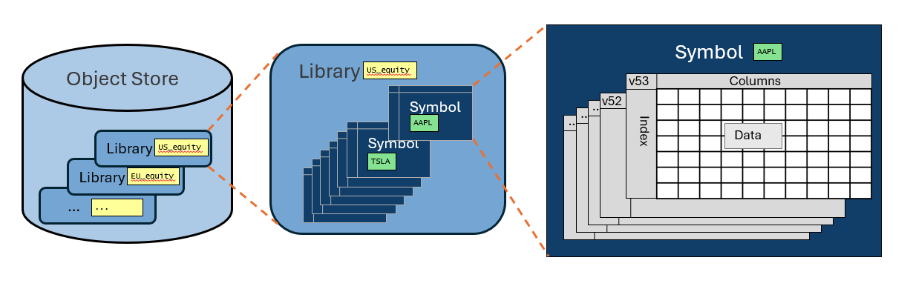
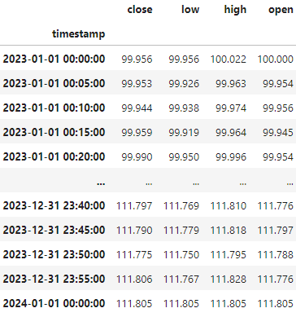
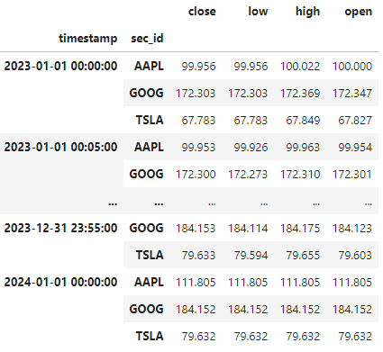

# Guidelines for Organising Your Data

## Introduction

We are often asked about how best to organise data in ArcticDB. There is no single answer to this question - it will depend on many factors, but especially on the data itself and how it will be used.

ArcticDB offers a high degree of flexibility in how data is arranged. Although this is a strength of the system, sometimes the choices are so broad that it is hard to know where to start.

In this guide we aim to outline some design principles and rules of thumb to help you decide the best scheme for your data, system and users.

We begin by taking a design view of the way ArcticDB structures data and the system design concerns, then from those consider how to assess and balance the trade-offs of some typical organisation strategies.

## ArcticDB's Data Hierarchy

Let's revisit the structures that ArcticDB provides for organising data, illustrated below

### Object Store

The object stores available will typically be decided by external factors such as

* Environment: prod/uat/research
* Permissions: enviroments that grant/deny read/write permission to different groups of users/systems
* Accounting: different cloud buckets may be charged to different internal accounts
* Storage Quotas: different amounts of storage may be allocated for different purposes
* Storage Performance: faster/slower storage for different applications according to requirements and cost

### Library

ArcticDB can handle a large number of libraries per object store - up to 50,000 is perfectly reasonable.

A library groups together a set of related data. Typically its primary purpose is to help catalog the data - well named/documented libraries help people find the data they need.

### Symbol

The symbol is the base unit of storage in ArcticDB. Each symbol is a DataFrame and has optimised data access on the columns and index of the DataFrame.

So the choice of how to use the (symbol, columns, index) is important to how the system will perform. It is also the full key to access a specific single data item from a DataFrame (including the version, when needed).

### Versions

Each symbol gets a new version every time it is modified. A consideration of how versions will be treated is a key design choice - in particular it will have a big impact how much storage is used. The most common choices are:

* Keep only the latest versions. Delete older versions either with `prune_previous_version` or in a background process (see [Enterprise Features](#enterprise-features)).
* Keep key versions only. Often implemented using [snapshots](snapshots.md).
* Keep all versions. This can use large amounts of storage if the data modifications are frequent but is very powerful for fully archiving the data.

## System Design Concerns

The following topics are necessary concerns when running a system. To that extent the data organisation plan must bear them in mind.

### Initial Data Population

This is usually a one-off process to get a system up and running. Ideally the same scripts can be used for initial data population and regular updates, with different parameters.

### Data Update Process

Regular updates to the data are the norm for most systems. We must consider in our design

* Delivery format (the format that the data source uses) vs storage format of the data. The trade-offs are
    * Storing data in a format close to delivery format makes it easier to reconcile with the source
    * The delivery format is often not the best format for downstream processes
* Frequency of data updates
* Storage growth characteristics over time
* System performance over time

### Efficient Downstream Access

Often the data is accessed by downstream users and systems much more frequently than it is updated. If that is the case, it is worth organising data to optimise downstream access performance.

### Data Problems: Investigation and Remediation

System problems are often caused by suspected bad data. It is worth thinking about how to investigate and remediate such problems. For example

* Tooling to find and examine suspected bad data
* Consider how to reconcile suspected bad data vs the original data source
* Manual overrides to fix bad data to allow the system to run effectively while data is re-sourced
* Versioning and snaphsots makes it easy to return to a last known good state

### Maintenance

Some routine maintenance is required to keep systems running efficiently and deal with problems, some of which may have causes from outside the system.

For ArcticDB specifically, the following issues are worth consideration:

* Version management (see [versions](#versions))
* Defragmentation
* Replication / Backup of data

There are [Enterprise Features](#enterprise-features) to help with these issues and more.

## General Performance Guidelines for ArcticDB

In this section we want to highlight some general rules of thumb that will help you get the best performance from ArcticDB.

### Properties of ArcticDB

It is worth understanding and bearing in mind these properties of the system

#### Indices

* The primary and performant index is the first DataFrame row index.
* The columns names are also a performant index.
* There are no secondary row or column indices.
* The symbol-list is a good index when compacted.
* The version-list is a good index when compacted.

#### Data

* DataFrame data is always stored columnar and compressed. ArcticDB is optimised to read and write these.
* DataFrame data is tiled and stored in objects (default is 100,000 rows x 127 cols)
* Data in different DataFrames is stored in different objects

### ArcticDB is Optimised for Large DataFrames

* Prefer a smaller number of symbols that have a large amount of data each
* Accessing date ranges and subsets of columns is very efficient
* Collecting together data from a large number of symbols can be slower

### Plan your Version Management

* In particular plan which versions to keep and how to delete the others
* Snapshots are useful for version management
* There are interactions between snapshots and versions: snapshots keep versions from being deleted

Please see the [snapshots documentation](snapshots.md) and [snapshots notebook](../notebooks/ArcticDB_demo_snapshots.ipynb) for more details.

### Lots of Small Appends or Updates Can Fragment Your Data

Append and Update are efficient because they always add new chunks of data rather than reorganising the existing data (actually update will reorganise but only where necessary which is typically only a small amount).

This means that lots of small appends or updates can result in lots of small data chunks, which makes reads slower.

You can defragment a symbol manually using the [defragment_symbol_data](../api/library.md) library function. Altnernatively the [Enterprise Features](#enterprise-features) offer background processes that will take care of defragmentation for you.

## Examples Based on Market Data

### Seperate Symbol for Each Security

The data for a single security would be a timeseries of market data. In this set of sample data this would be all the price data for AAPL.

Every security has its own symbol with the same data shape.

#### Pros

* Ideal for single security analysis
* The delivery format for the data is often per security
* The update process is simple

#### Cons

* Analysis involving many securities requires reading many symbols
* Time index for raw data may not match between securities.

The data is easier to use with [time index alignment](#time-index-alignment).

### Single Symbol for all Securities

The data for all securities is merged together into a single symbol.

The security identifier is included as an extra index column. Note that DataFrames with a Pandas MultiIndex will round trip correctly, which is useful. However the high performance ArcticDB indexing is only on the primary index level.

#### Pros

* Good for analysis involving many securities at once eg. portfolio analysis
* A single large DataFrame tends to give very good read performance

#### Cons

* The update process is more complicated. Probably needs a read, modify, write sequence of operations (although see [Future Features](#planned-future-features-and-improvements))
* Time index for raw data may not match between securities.

The data is easier to use with [time index alignment](#time-index-alignment).

### Single Symbol for each Data Item

A symbol holds the timeseries for all securities for a single field. In the example below are the close prices over time for all securities.

#### Pros

* Good for analysis involving many securities at once eg. portfolio analysis
* A single large DataFrame tends to give very good read performance
* Update process is reasonably simple.

#### Cons

* Time index for raw data may not match between securities. 

The data is easier to use with [time index alignment](#time-index-alignment).

## Time Index Alignment

Raw data may not be time-aligned

* The underlying tick data arrives at arbitrary times
* Different products have different trading hours
* Some securities may trade less frequently

For many purposes time-aligned data is either necessary or makes the task much simpler.

Resampling is one way to align data. There is a Pandas resample function and a faster function planned in ArcticDB (see [Future Features](#planned-future-features-and-improvements)).

## Enterprise Features

Many of the housekeeping and maintenance procedures recommended in this guide are taken care of by processes available in the ArcticDB Enterprise package. Please contact us if you would like to explore further. Click the _Get ArcticDB_ button on our [website](https://arcticdb.io/) to contact us.

## Planned Future Features and Improvements

We are always improving and adding new features to ArcticDB. Below are a few relevant new features that are in our plans

* **Multi-Index:** support for more flexible data updates for multi-index symbols.
* **Resampling:** a planned [QueryBuilder](../api/query_builder) extension that will allow fast on-the-fly resampling of data as part of the read.

If you have a suggestion for a new feature, please raise an issue on our [github](https://github.com/man-group/ArcticDB). Please include as much detail as possible.

